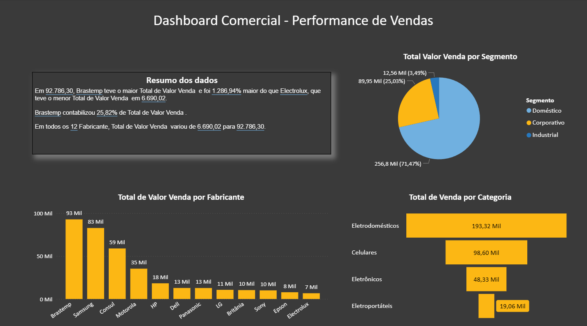
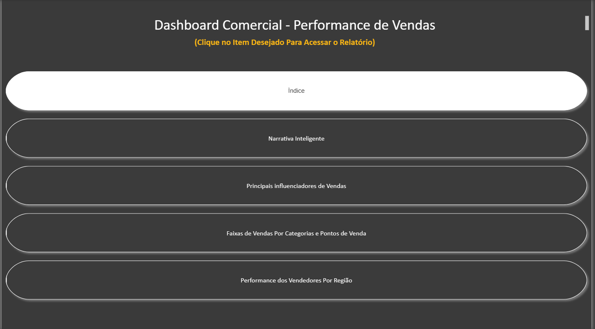
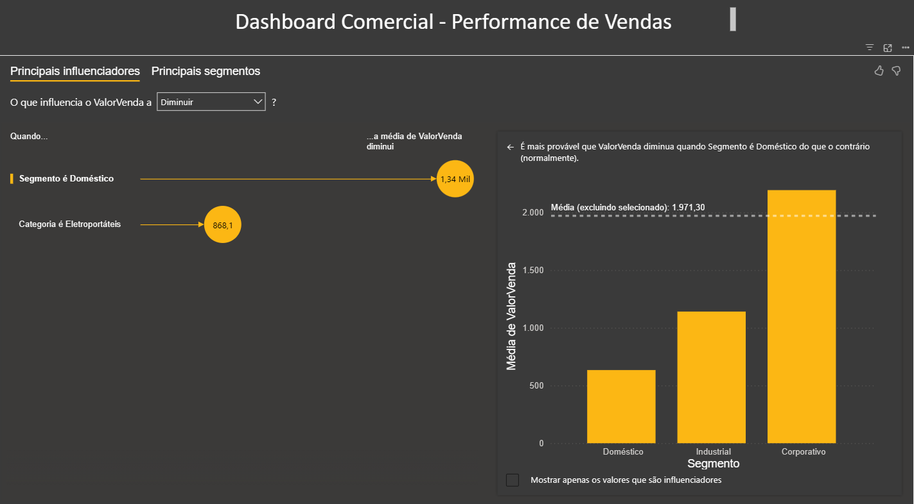
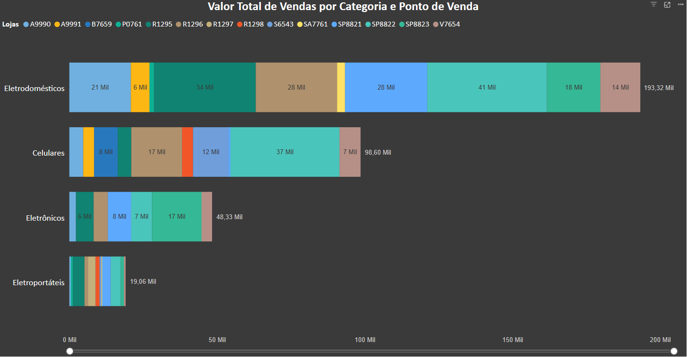
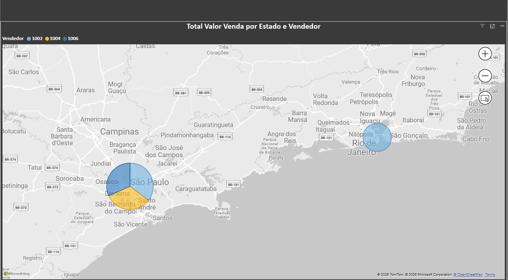

# Dashboard de Análise Comercial

## Sobre o Projeto

Este projeto foi desenvolvido no **Power BI** com o objetivo de criar um dashboard interativo para análise de vendas, permitindo acompanhar o desempenho comercial por fabricantes, categorias, segmentos, vendedores e regiões.

Durante o desenvolvimento foram utilizados recursos como **Power Query**, **Narrativa Inteligente**, **Principais Influenciadores**, **mapas** e diferentes visualizações analíticas para transformar dados em informações úteis para apoio à tomada de decisão.

## Visão Geral

Abaixo está a visão principal do dashboard.

## Estrutura do Dashboard

O dashboard foi organizado em diferentes páginas para facilitar a exploração das informações comerciais.

## 🛠️ Tecnologias Utilizadas

- Power BI Desktop
- Power Query
- Narrativa Inteligente
- Principais Influenciadores
- Mapas Interativos
- Visualizações Analíticas

---

## 💼 Competências Demonstradas

Durante o desenvolvimento deste projeto foram aplicados conhecimentos relacionados a:

- Tratamento e transformação de dados utilizando Power Query
- Construção de dashboards interativos
- Desenvolvimento de indicadores comerciais
- Análise de desempenho por categoria, fabricante, vendedor e região
- Utilização de recursos de Inteligência Artificial do Power BI
- Storytelling com dados

---

## 💡 Principais Insights

Este dashboard permite identificar rapidamente:

- Fabricantes com melhor desempenho em vendas.
- Categorias com maior representatividade no faturamento.
- Fatores que mais influenciam os resultados comerciais.
- Distribuição das vendas por região e vendedores.
- Participação das lojas nas vendas por categoria.

---

## 📚 Aprendizados

Durante este projeto foi possível aprofundar conhecimentos em:

- Criação de dashboards voltados para análise comercial.
- Organização de informações em múltiplas páginas.
- Construção de visualizações para diferentes públicos.
- Aplicação de recursos avançados do Power BI, como Narrativa Inteligente e Principais Influenciadores.
- Boas práticas na apresentação e documentação de projetos para portfólio.

---

## 🎓 Contexto do Projeto

Este dashboard foi desenvolvido como parte das atividades práticas do curso de Power BI.

A proposta inicial foi fornecida como base de estudo, porém o desenvolvimento do dashboard, a organização das análises e a documentação apresentada neste repositório foram elaborados como prática para consolidação dos conhecimentos em Business Intelligence.

## Demonstração das Páginas

Abaixo estão as principais páginas desenvolvidas no dashboard, cada uma com um objetivo específico para apoiar a análise comercial.

###  Índice:

Página inicial utilizada para navegação entre todas as análises do dashboard.

---

###  Narrativa Inteligente:

Apresenta um resumo automático dos principais resultados encontrados nos dados, destacando fabricantes, segmentos e categorias com maior desempenho.

---

###  Principais Influenciadores:

Utiliza o recurso de Inteligência Artificial do Power BI para identificar os fatores que mais influenciam o desempenho das vendas.

---

###  Vendas por Categoria e Loja:

Permite comparar o valor total vendido por categoria e analisar a participação de cada ponto de venda.

---

###  Performance Regional:

Apresenta a distribuição das vendas por região e vendedor através de um mapa interativo.

---

**Este projeto faz parte do meu portfólio de Análise de Dados e representa a aplicação prática dos conhecimentos adquiridos em Power BI, com foco na criação de dashboards para apoio à tomada de decisão**.
